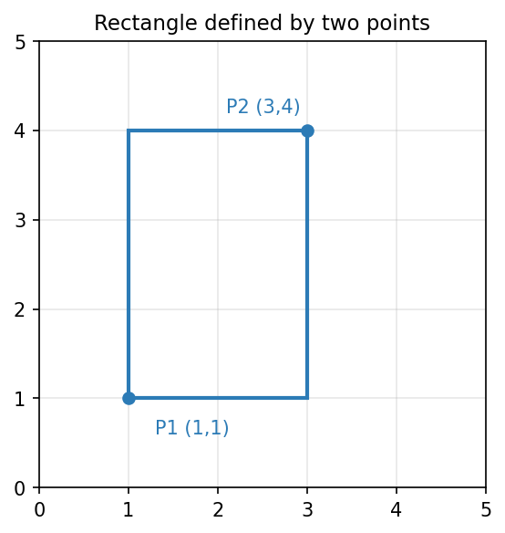
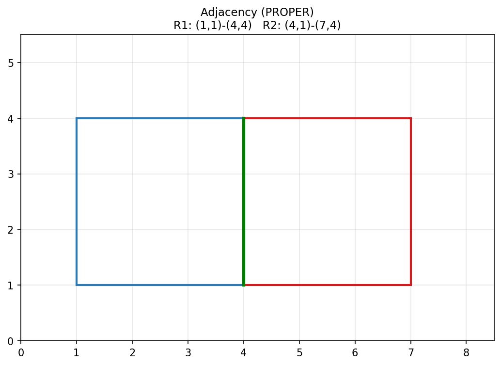
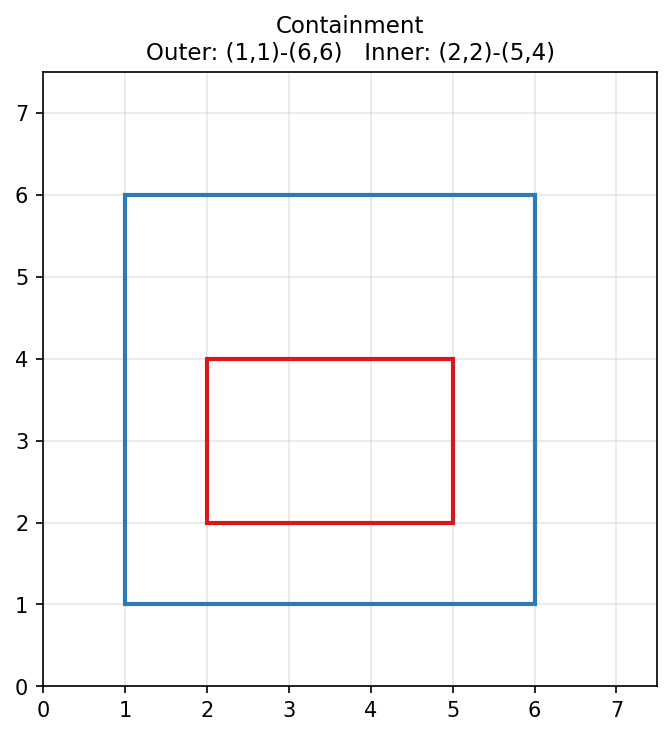
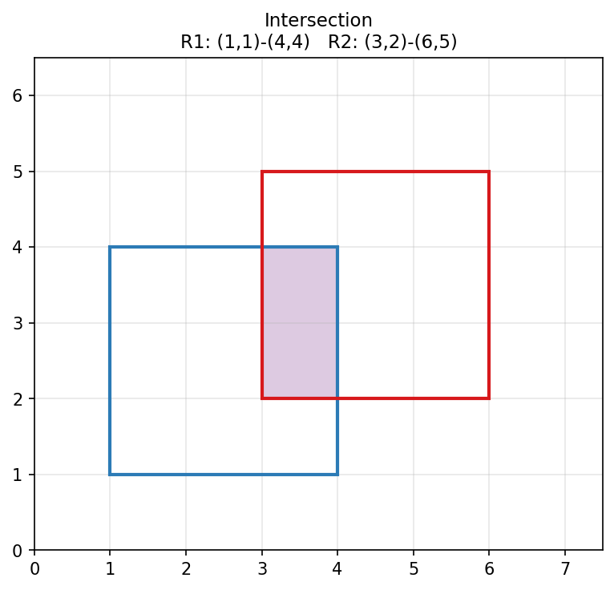

# Rectangle Analyzer

A Java application that analyzes relationships between rectangles, including containment, adjacency classification, and intersection detection.

## Prerequisites

- Java 21
- Maven 3.9+ (or use the maven wrapper)

### Installing Java 21 on Ubuntu

```bash
sudo apt update
sudo apt install -y openjdk-21-jdk
export JAVA_HOME=/usr/lib/jvm/java-21-openjdk-amd64
```

To persist `JAVA_HOME` across sessions:

```bash
echo 'export JAVA_HOME=/usr/lib/jvm/java-21-openjdk-amd64' >> ~/.bashrc
source ~/.bashrc
```

> Note: The path to the JDK will vary from architecture to architecture

## Features

- Determine whether one rectangle contains another
- Classify adjacency between rectangles (PROPER, PARTIAL, SUBLINE, NONE)
- Compute intersection region for overlapping rectangles

## Assumptions

- Rectangles are defined by two points with non-zero width and height
- Containment is inclusive (identical rectangles are considered contained)
- Adjacency requires a shared boundary with positive length
- Intersection is defined as the overlapping area between two rectangles. The four returned points are the corners of that overlap region. Shared edges or corners alone are not considered intersections.

The following image depicts a rectangle defined by two points (1, 1) and (3, 4)


## Run Tests

```bash
./mvnw test
```

## Build

```bash
./mvnw package
```

## Run

```bash
./mvnw package -DskipTests
java -cp target/rectangle-1.0-SNAPSHOT.jar com.ty.Main
```

## Docker

Build and run using Docker:

```bash
docker build -t rectangle .
docker run rectangle
```

## Code Coverage

Run tests and generate a Jacoco coverage report

```bash
./mvnw test
```

Open the report in a browser at the following location

```
target/site/jacoco/index.html
```

## Visual Examples of Adjacency, Containment, Intersection

### Adjacency (Proper)


### Containment


### Intersection
